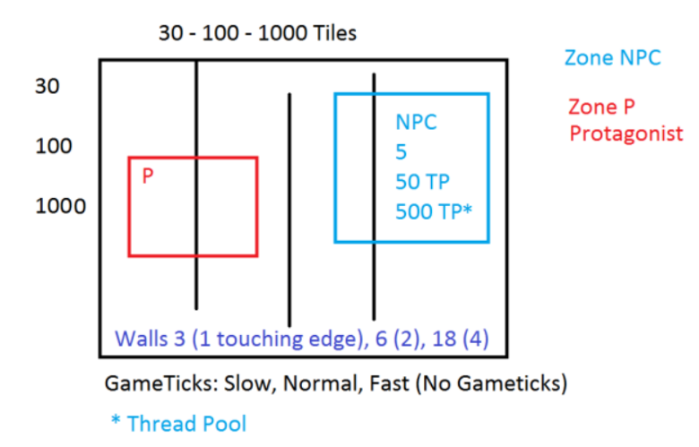

# SDL A* Pathfinding Simulation using Multithreading.

>3 grids (30X30,100X100 and 1000X1000 grids) 

>3 Different collection of NPCS (5,50,500) performing A*

>Use multiple threads to enhance the system (ie increase FPS)

| ToDo            |Est Time  |Done?|  
| -------------   |:--------:|-----|
| Add label       | 30m      |    |
| Add NPC         | 10m      |    | 
| Rendering Tread | 30m      |    |
| Implement A*    | 3hrs     |    | 
| Add Player      | 1hr      |    |
| SetasNPC target | 10m      |    |
| UI for switching| 30m      |    |
| UI for FPS etc. | 30m      |    |
| Thread NPCs     | 4hrs     |    |
| toggle threading| 20m      |    |
| examine results | 2hr      |    |
